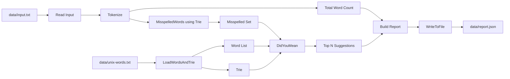

# Spell Checker & Autocomplete (Day 11)

## Project Understanding

This is a CLI spell-check pipeline for text-editor style workflows:
- Load a large dictionary into a Unicode-safe Trie.
- Tokenize input text into words.
- Detect misspelled words (`word` not found in Trie).
- Generate did-you-mean suggestions using:
  1. Levenshtein distance (`<= 2`)
  2. BST ranking by distance and frequency.
- Write a JSON spell-check report to file.

The core goal is to combine data structures (Trie + BST) with file streaming (`bufio.Scanner`) and JSON output (`json.Encoder`) in clean Go packages.

## Architecture (Mermaid)

### 1) End-to-End Flow



### 2) Suggestion Ranking Internals

```mermaid
flowchart LR
    W[Input Word] --> N[Normalize]
    N --> LOOP[Loop Dictionary Candidates]
    LOOP --> LD[Levenshtein Distance]
    LD --> F{distance <= 2 ?}
    F -- no --> LOOP
    F -- yes --> B[BST Insert by rank]
    B --> LOOP
    LOOP --> S[BST.Sorted(limit)]
    S --> O[Top Suggestions]
```

### 3) Trie Delete and Prune Logic

```mermaid
flowchart TD
    A[Delete(word)] --> B[Recursive Walk by Rune]
    B --> C{Word Exists?}
    C -- no --> X[Return false]
    C -- yes --> D[Unset IsWord and Frequency=0]
    D --> E[Backtrack]
    E --> F{Child has no children and IsWord=false?}
    F -- yes --> G[Prune child pointer]
    F -- no --> H[Keep child]
```

## Technical Summary

| Module | Core DS/Algo | Responsibility | Cost (typical) |
|---|---|---|---|
| `internal/dictionary` | Scanner stream | Load dictionary line-by-line, normalize words | `O(total dictionary runes)` |
| `trie` | Rune Trie | Exact lookup + prefix traversal + delete pruning | `O(word length)` per lookup/insert |
| `internal/spellcheck` | Token stream + set | Tokenize text, dedupe misspelled tokens | `O(total input runes)` |
| `internal/distance` | DP matrix | Levenshtein distance on runes | `O(a*b)` time, `O(a*b)` space |
| `internal/ranking` | BST | Keep deterministic suggestion ordering | `O(log n)` average insert, `O(n)` traversal |
| `internal/report` | JSON encoder | Serialize output report to file | `O(report size)` |

## Deep Dive

### Trie internals

- Each node stores `map[rune]*Node`, `IsWord`, and `Frequency`.
- `Insert` walks rune by rune; missing children are allocated lazily.
- `Search` and `StartsWith` walk the same path but differ in terminal validation:
  - `Search` requires `IsWord=true` at terminal node.
  - `StartsWith` only requires that path exists.
- `Delete` uses recursive backtracking:
  - Unsets `IsWord` and resets frequency at terminal word node.
  - Prunes child nodes only when they are no longer needed by any other word.
- `AutoComplete` starts from the prefix node and returns top-`limit` words by frequency (and lexical tie-break).

### Did-You-Mean internals

- Pipeline for one misspelled word:
  1. Normalize input.
  2. Iterate dictionary words.
  3. Compute Levenshtein distance.
  4. Keep only candidates with distance `<=2`.
  5. Insert into BST with ordering:
     - lower distance first
     - higher frequency next
     - lexical order as deterministic final tie-break
  6. In-order traversal returns ranked suggestions.
- Duplicate dictionary lines are deduplicated during candidate scan, so one word appears once in suggestions.

### Levenshtein DP internals

- Uses rune slices to stay Unicode-safe.
- `dp[i][j]` means edit distance between first `i` runes of source and first `j` runes of target.
- Transition:
  - delete: `dp[i-1][j] + 1`
  - insert: `dp[i][j-1] + 1`
  - replace/match: `dp[i-1][j-1] + cost` (`cost=0` for match, `1` for replace)
- Final answer is `dp[len(a)][len(b)]`.

### Tokenization behavior

- Tokenizer keeps letters, digits, and combining marks.
- Non-word separators (space, punctuation, newline, tabs) flush current token.
- Words are lowercased before dictionary lookup.
- Misspelled output is deduplicated (`wrld wrld` appears once in report corrections).

### File IO behavior

- Dictionary load is streaming via `bufio.Scanner`; it does not load full file into memory in one read.
- Scanner buffer is increased to support longer lines safely.
- Lines beginning with `#` are treated as comments and ignored.
- Report is written using `json.Encoder` with indentation for readability.

### Complexity summary

- Dictionary load: `O(total_runes_in_dictionary)`
- Trie insert/search per word: `O(word_length)`
- Spell-check over input text: `O(total_input_runes)` for tokenization + lookups
- Autocomplete:
  - prefix walk: `O(prefix_length)`
  - traversal cost depends on size of prefix subtree
- Did-you-mean for one word:
  - roughly `O(D * L^2)` where:
    - `D` = number of dictionary words scanned
    - `L` = average candidate word length (DP cost)
  - this is the heaviest part at scale

### Tradeoffs and design decisions

- Trie gives fast exact lookup and prefix lookup, but uses more memory than a flat word list.
- BST ranking gives deterministic ordering without sorting the entire candidate slice at the end.
- Scanning full dictionary for each misspelled token keeps implementation simple, but is CPU-heavy for large dictionaries.
- Current design is correctness-first and easy to reason about; it can be optimized later with prefilters (length window, prefix buckets, BK-tree).

### Edge cases handled

- Empty input file: valid output with `total_words=0`.
- Unicode words: supported via rune-based trie and distance DP.
- Duplicate dictionary entries: frequencies accumulate in trie; suggestion list deduplicates words.
- Missing files / bad paths: surfaced with wrapped errors and non-zero process exit.
- Invalid suggestion limit (`<=0`): reset to default behavior in CLI flow.

## Dictionary

External dictionary pulled from:
`https://raw.githubusercontent.com/dolph/dictionary/refs/heads/master/unix-words`

Saved as:
- `data/unix-words.txt` (235,886 words)

Default CLI now uses this file.

## Run

From project root:

```bash
go run ./cmd/spellcheck
```

Defaults:
- `-dict data/unix-words.txt`
- `-in data/input.txt`
- `-out data/report.json`
- `-limit 5`

Override example:

```bash
go run ./cmd/spellcheck -in data/input.txt -out data/report.json -limit 5
```

## Test

```bash
go test ./...
```

## Benchmark (Autocomplete Latency)

```bash
go test -bench=BenchmarkAutoCompleteLargeDictionary -benchmem ./internal/spellcheck
```

## JSON Report Shape

```json
{
  "total_words": 500,
  "misspelled": 12,
  "corrections": [
    {
      "word": "progrm",
      "suggestions": [
        {"word": "program", "distance": 1, "frequency": 120}
      ]
    }
  ]
}
```
