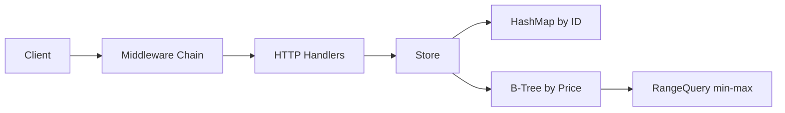

# E-Commerce Product Catalog (Day 12)

REST API product catalog using:
- HashMap index by product ID
- B-Tree index by product price
- `net/http` handlers + middleware chain

## Architecture



## Endpoints

- `POST /products`
- `GET /products/{id}`
- `GET /products?min_price=X&max_price=Y`
- `GET /products?category=X&sort=price&order=asc|desc`
- `GET /products?page=1&size=20`
- `PUT /products/{id}`
- `DELETE /products/{id}`
- `GET /products/stats`

## Middleware

- Logging: method, path, query, status, duration
- Timing: `X-Response-Time-Ms`
- JSON content-type enforcement (`POST`/`PUT`)
- Panic recovery (returns `500` JSON)

## Run

```bash
go run ./cmd/server
```

Server:
- API on `:8080`
- pprof exposed via `/debug/pprof/...`

## Tests

```bash
go test ./...
```

Includes:
- B-Tree unit tests
- Store unit tests
- Handler tests
- API integration test (`httptest.NewServer`)

## Benchmarks

### B-Tree operation benchmarks

```bash
go test -bench=BenchmarkBTree -benchmem ./internal/btree
```

Captured output:

```text
BenchmarkBTreeInsert/n=1000-16             10000      110929 ns/op     52184 B/op      184 allocs/op
BenchmarkBTreeInsert/n=10000-16              867     1552531 ns/op    527456 B/op     1662 allocs/op
BenchmarkBTreeInsert/n=100000-16              62    17450822 ns/op   5288523 B/op    16369 allocs/op
BenchmarkBTreeSearch/n=1000-16          33274380          32.17 ns/op        0 B/op        0 allocs/op
BenchmarkBTreeSearch/n=10000-16         25395429          46.68 ns/op        0 B/op        0 allocs/op
BenchmarkBTreeSearch/n=100000-16        17912660          63.05 ns/op        0 B/op        0 allocs/op
BenchmarkBTreeRangeQuery/n=1000-16        475376        3557 ns/op       3738 B/op        8 allocs/op
BenchmarkBTreeRangeQuery/n=10000-16       111324        9056 ns/op       4053 B/op        8 allocs/op
BenchmarkBTreeRangeQuery/n=100000-16       18285       65637 ns/op       4085 B/op        8 allocs/op
BenchmarkBTreeDelete/n=1000-16              6807      241018 ns/op    120752 B/op      369 allocs/op
BenchmarkBTreeDelete/n=10000-16              354     2945033 ns/op   1218754 B/op     3325 allocs/op
BenchmarkBTreeDelete/n=100000-16              37    31862822 ns/op  12182089 B/op    32736 allocs/op
```

### B-Tree vs linear range query (100K products)

```bash
go test -bench=BenchmarkRangeQueryBTreeVsLinear100K -benchmem ./internal/store
```

Captured output:

```text
BenchmarkRangeQueryBTreeVsLinear100K/BTree/narrow-16       12247       97153 ns/op     177136 B/op    1026 allocs/op
BenchmarkRangeQueryBTreeVsLinear100K/Linear/narrow-16        501     2899669 ns/op     146168 B/op    1016 allocs/op
BenchmarkRangeQueryBTreeVsLinear100K/BTree/medium-16        1347      798250 ns/op    1385200 B/op    7535 allocs/op
BenchmarkRangeQueryBTreeVsLinear100K/Linear/medium-16        333     3418796 ns/op    1180920 B/op    7522 allocs/op
BenchmarkRangeQueryBTreeVsLinear100K/BTree/wide-16            98    15852658 ns/op   19647218 B/op   97554 allocs/op
BenchmarkRangeQueryBTreeVsLinear100K/Linear/wide-16          100    13447662 ns/op   16977147 B/op   97533 allocs/op
```

Interpretation:
- Narrow and medium windows: B-Tree range query is clearly faster.
- Very wide windows (close to full scan): linear scan can become competitive/faster.

## Profiling (CPU + Heap)

Generate profiles:

```bash
mkdir -p profiles
go test -run=^$ -bench=BenchmarkRangeQueryBTreeProfile1000 -benchtime=1x -cpuprofile=profiles/cpu_btree.prof -memprofile=profiles/heap_btree.prof ./internal/store
go test -run=^$ -bench=BenchmarkRangeQueryLinearProfile1000 -benchtime=1x -cpuprofile=profiles/cpu_linear.prof -memprofile=profiles/heap_linear.prof ./internal/store
```

Inspect top CPU and heap:

```bash
go tool pprof -top profiles/cpu_btree.prof
go tool pprof -top profiles/cpu_linear.prof
go tool pprof -top profiles/heap_btree.prof
go tool pprof -top profiles/heap_linear.prof
```

### CPU findings (top)

- Winner for profiled workload (100K products, 1000 range queries in `500..2000`):
  - **B-Tree path is faster**
  - `BenchmarkRangeQueryBTreeProfile1000`: `776775177 ns/op` (~0.777s)
  - `BenchmarkRangeQueryLinearProfile1000`: `3159724645 ns/op` (~3.160s)
  - B-Tree speedup in this profile: **~4.07x**

- B-Tree CPU top contributors (`cpu_btree.prof`):
  - GC scanning (`runtime.tryDeferToSpanScan`, `runtime.scanObject`, `runtime.scanSpan`)
  - `catalog/internal/store.filterProducts`
  - `catalog/internal/store.sortProducts.func1`

- Linear CPU top contributors (`cpu_linear.prof`):
  - `catalog/internal/store.(*Store).linearRangeQuery` is the primary hot path (~37% flat)
  - GC scanning remains the next largest contributor

### Heap findings (alloc_space)

- B-Tree path total alloc_space: ~`1380.54MB`
  - Largest allocators: `filterProducts`, `getCandidatesFromPriceIndex`, B-Tree `rangeQuery`.
- Linear path total alloc_space: ~`1203.91MB`
  - Dominated by `linearRangeQuery` copies.

Note:
- B-Tree path is significantly faster for typical selective ranges, but current implementation allocates more memory due to candidate aggregation + copies + sort pipeline.

## Project Structure

```text
catalog/
├── cmd/server/main.go
├── internal/
│   ├── btree/
│   ├── handlers/
│   ├── middleware/
│   ├── models/
│   └── store/
└── testdata/products.json
```
