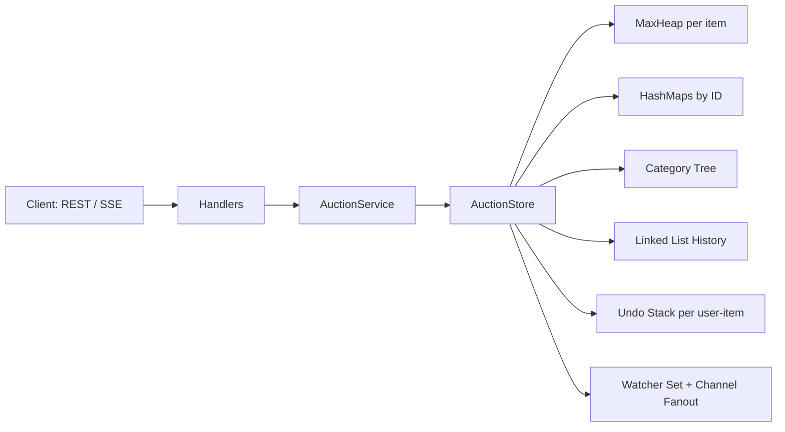
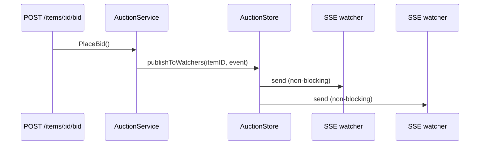
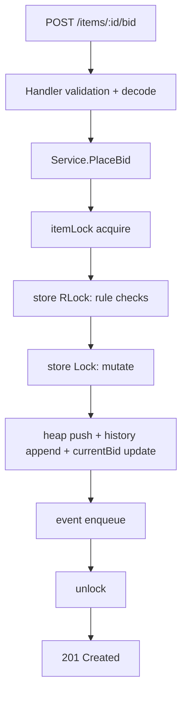

# Real-Time Auction Architecture (Day 14)

## 1. Layered Composition



Architecture is explicitly layered:
- `handlers`: transport contract (HTTP parsing, status codes, JSON I/O).
- `auction/service`: domain rules and orchestration.
- `auction/store`: shared state + lock orchestration.
- `ds/*`: raw data structures (heap, stack, linked list, tree).

This is **composition over inheritance**: handlers compose service, service composes store, store composes DS instances.

## 2. Request Path and Middleware Pattern

Middleware chain uses the **Decorator pattern** around `http.Handler`.

```text
Recovery(Logging(AuthSimulation(RateLimiter(ResponseTiming(Mux)))))
```

Responsibilities:
- `Recovery`: converts panic to `500` JSON.
- `Logging`: method/path/status/duration.
- `AuthSimulation`: maps `X-User-ID` header into request context.
- `RateLimiter`: domain-agnostic token bucket middleware configured in server wiring with a bid-route matcher and user-key extractor.
- `ResponseTiming`: injects `X-Response-Time`.

This keeps cross-cutting concerns orthogonal to domain logic.

## 3. Concurrency Model and Locking Discipline

### Lock Order Invariant

```text
itemLock(itemID) -> store.mu (RWMutex)
```

Why:
- `itemLock` provides fine-grained serialization per auction item.
- `store.mu` protects shared maps and compound store state.
- Fixed acquisition order prevents lock inversion deadlocks.

### Critical Sections
- Validate/read under `RLock` where possible.
- Mutate under `Lock`.
- Publish events and write network responses **outside locks** when feasible.

## 4. Eventing and SSE Fan-out

Current event path:
1. Domain mutation builds a `BidEvent` after state update.
2. Service calls `publishToWatchers(itemID, event)`.
3. Store snapshots watcher channels for that item and attempts non-blocking send to each watcher.



Applied patterns:
- **Fan-out Pub/Sub** (service/store -> multiple watchers).
- **Backpressure strategy**: drop-on-full watcher channels to protect write path latency.

## 5. Domain Data-Structure Mapping

| Domain Concern | Data Structure | Reason |
|---|---|---|
| Highest bid lookup | `MaxHeap[*Bid]` per item | `O(1)` peek for winner; `O(log n)` insert/pop |
| Entity lookup | HashMaps by typed ID | Fast direct access, simple ownership model |
| Category browsing | Generic rooted tree + subtree traversal | Hierarchical browse semantics |
| Bid history timeline | Linked list + item `BidHistory` IDs | Linked list retained for DS requirement, item IDs used for JSON replay |
| User undo | Stack per `(userID,itemID)` | LIFO retract semantics |

Complexity highlights:
- `PlaceBid`: `O(log n)` due to heap push.
- `RetractLastBid`: amortized `O(log n)` with lazy retracted-top cleanup.
- `EndAuction`: `O(k log n)` where `k` is number of retracted tops cleaned.

## 6. End-to-End Bid Flow (Technical)



Validation rules enforced in service:
- amount finite and `> 0`
- item exists and auction active + within time window
- bidder exists, not seller, and has enough balance
- amount must exceed current effective top bid

## 7. API Contract Strategy

- Handlers own transport-level validation and status mapping.
- Service returns domain errors; handlers map them deterministically:
  - `404`: not found errors
  - `400`: malformed input / invalid request form
  - `409`: invalid auction state or business-rule conflict
  - `500`: unexpected internal failure

This is a **Hexagonal-ish boundary**: domain logic remains transport-agnostic.

## 8. Operational/Profiling Hooks

- pprof mounted on `/debug/pprof/*`.
- CPU, heap, goroutine, mutex profiles can be collected without code changes.
- Profiling should be run under realistic concurrent bidding load to expose lock contention and queue pressure.
